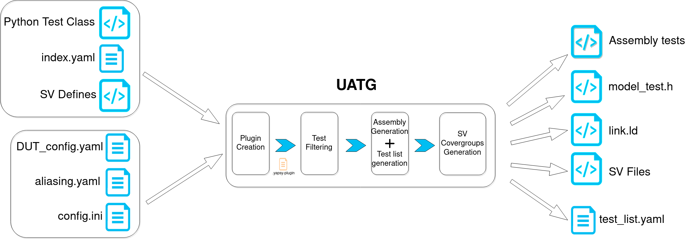

.. See LICENSE.incore for details

.. _overview:

========
Overview
========

``UATG`` - μArchitectural Test Generator - is an open-source python based framework developed
by InCore to generate RISC-V Assembly tests for functional verification of the RISC-V cores 
(currently supports in-house and SHAKTI cores only). While complements of UATG, like
`RISCV-CTG <https://github.com/riscv-software-src/riscv-ctg>`_ , `AAPG
<https://gitlab.com/shaktiproject/tools/aapg>`_, etc work at the ISA level and focus on generating 
tests to maximize ISA coverage, UATG is more focused on micro-architecture driven tests. 
Micro-architectural components like caches, branch predictors, scoreboards, etc which are more
implementation driven and less ISA defined, require a dedicated set of tests to be written to test
them thoroughly.

Also, as InCore is primarily focused on core-generators like `Chromite
<https://gitlab.com/incoresemi/core-generators/chromite>`_, a significant portion of the
micro-architectural features are heavily parameterized. Making it difficult to create individual 
tests for each configuration. UATG addresses this by facilitating the generation of an equally 
parameterized set of verification tests for these micro-architectural features.

UATG provides a minimal framework which allows one to create parameterized set of tests which UATG 
can generate and filter based on the input configuration of the target device. Along with generating tests, 
UATG also provides hooks to define and generate a parameterized set of coverpoints which can help indicate 
the health of the test-suite being run on a target. 

The parameterized tests in UATG are written as python-plugins which can generate assembly programs. 
These python programs are required to follow a certain API as outlined by UATG and produce artifacts
which UATG can use to generate the final Assembly tests. These python plugins have the capability to
generate relevant tests based on the configuration of the target DUT or skip generation completely
if certain features in the configuration have been disabled. 

.. note:: These tests are significantly compatible with the TestFormat Spec outlined `here <https://github.com/riscv-non-isa/riscv-arch-test/blob/master/spec/TestFormatSpec.adoc>`_, 
  however do expect minimal divergence from the spec as features of UATG evolve.

UATG has ensured that the framework and tests are decoupled. Thus, the tests themselves can be
hosted as a separate directory or repository and can be fed into UATG to generate Assembly tests. 
Examples of python-plugins for some of Chromite's modules are present in the 
`chromite_uatg_tests <https://github.com/incoresemi/chromite_uatg_tests>`_ repository.

The tests generated using UATG can be run on the DUT in the conventional way or by using a 
framework like `RiVer Core <https://github.com/incoresemi/river_core>`_. The `UATG plugin
<https://github.com/incoresemi/river_core_plugins/tree/master/generator_plugins/uatg_plugin>`_ for RiVer
Core automatically selects the UATG to generate the tests, run it on the DUT, 
obtain coverage as well as compare the logs from DUT with the reference and finally provide a 
comprehensive report of your test's health!

Steps to install and run the tests can be found in the :ref:`quickstart <quickstart>` section of this document. 

Steps to create tests can be found here in the :ref:`UATG Framework <creating_new_tests>` section.

The overall tool flow is shown in the diagram below:

In addition to generating tests, the user can use regular expressions and parse
the logs for finding the coverage of his test. The ``validate`` feature of UATG
does this. The flow is shown in the diagram below:

